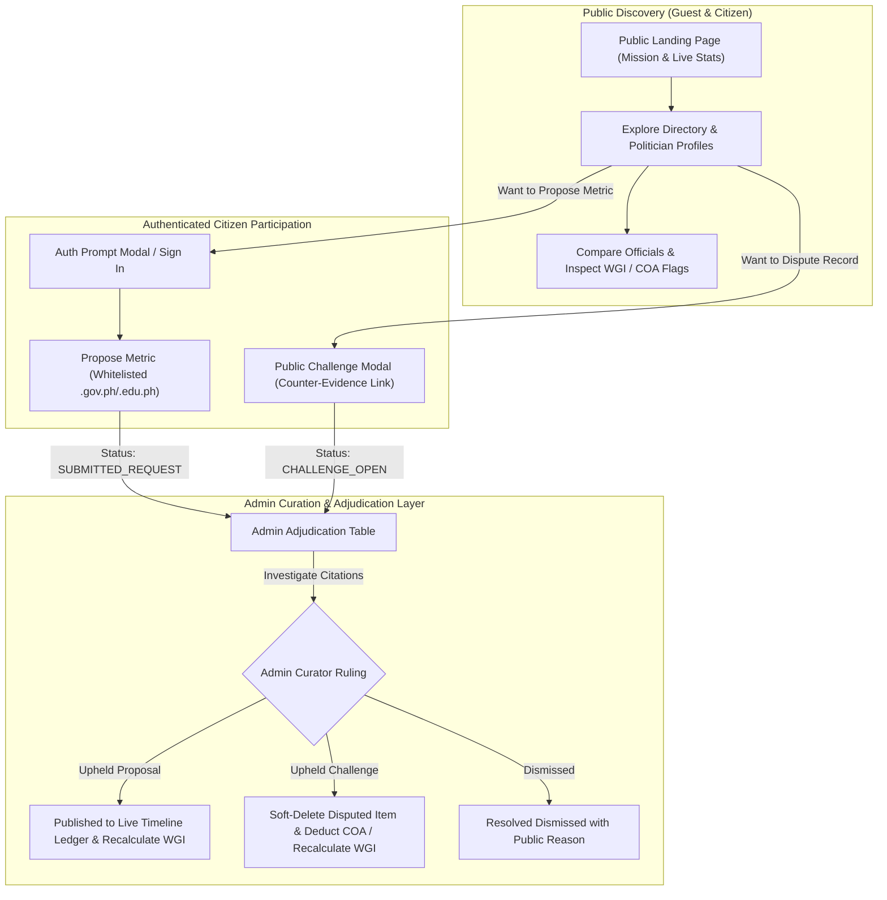

# Comprehensive System Scan & Architecture Plan: PolitikApp (2.0 Alignment)

## Executive Summary

PolitikApp has evolved from its initial Phase 1 crowdsourced peer-jury experiment into its current **2.0 Architecture: Centralized Evidence-Based Admin Curation and Citizen Public Disputes** (established in commits `dfd19fb` and `5daf0a1`, and codified in migrations `V14` and `V15`).

This plan incorporates:
1. **Safe, Phased Removal of Phased-Out 1.0 Code**: Decommissioning dead schedulers, deprecated peer voting, and obsolete 1.0 jury components with strict import-verification gates to prevent broken Vite builds.
2. **Robust Client-Side Deep Linking**: Implementing `window.history.pushState` with full `popstate` browser navigation support and graceful fallback for stale/invalid cold-load IDs.
3. **Memory-Safe Rate Limiting**: An in-memory sliding window rate limiter with periodic cleanup to protect against brute force and queue flooding, structured modularly for future distributed Redis drop-in.
4. **Public Guest Experience & Landing Page**: High-impact "front door" explaining the primary-source mission, live platform statistics, and seamless read-only guest browsing (Directory, Profiles, Compare, Rankings).
5. **Critical Security Hardening**: Eliminating the `X-Sandbox-Role-Override` backdoor, preventing self-promotion in `PUT /users/me`, enforcing authenticated submissions, and removing plaintext credentials.

---

## Critical Risks & Engineering Refinements

### Risk 1: Circular Imports / Broken JSX Imports on File Deletion
- **Risk**: Deleting 18 frontend files simultaneously could break the Vite build (`npm run build`) if any active component, CSS file, or helper has an unexpected indirect import.
- **Mitigation**:
  1. **Pre-deletion Import Scan**: Automated grep across `frontend/src` for all 18 component names to guarantee zero active references.
  2. **Decouple First**: Remove dead imports and routes from `App.jsx`, `ModerationPanel.jsx`, etc., and run `npm run build` *before* deleting the files.
  3. **Style Preservation**: Ensure shared design tokens or utility classes from `Module2.css` and `Module3.css` that are still used by active components (like `AdminAdjudicationTable.jsx` or `UserProfileMatrixPanel.jsx`) are preserved.
  4. **Post-deletion Verification**: Run `npm run build` and `npm run lint` immediately after file deletion.

### Risk 2: Deep Linking & Client-Side Routing Edge Cases
- **Risk**: Query-parameter routing (`?view=profile&id=...`) without a full router library can desynchronize UI state or crash on edge cases.
- **Mitigation**:
  1. **`popstate` Event Listener**: Attach a `window.addEventListener('popstate')` effect in `App.jsx` so browser **Back** and **Forward** buttons correctly restore both `activeView` and `selectedPoliticianId`.
  2. **Loop & Trap Prevention**: Avoid calling `pushState` when reacting to a `popstate` event. Use `history.replaceState` for in-place parameter adjustments (such as tab switches) to prevent polluting the browser history stack.
  3. **Cold-Load / Invalid ID Handling**: When a user opens a direct link (e.g. `?view=profile&id=123`):
     - If the politician data is still loading, show a skeleton state rather than a blank page.
     - If the ID does not exist in the database, display a user-friendly *"Politician profile not found"* alert with a button to *"Browse Directory"*, falling back cleanly without crashing.

### Risk 3: In-Memory Rate Limiting in Single vs. Multi-Instance Environments
- **Risk**: A naive in-memory map can cause memory leaks from millions of distinct IP addresses, and will not synchronize across multiple cloud instances.
- **Mitigation**:
  1. **Eviction & Expiration**: Implement a sliding-window counter using a self-cleaning cache with maximum entry caps and TTL eviction (clearing expired window keys every 5 minutes) to prevent memory bloat.
  2. **Modular Architecture**: Define a `RateLimiter` interface implemented by `InMemorySlidingWindowRateLimiter`. If the deployment scales to multi-instance cloud containers, a Redis-backed token bucket (e.g. Redisson / Bucket4j-redis) can be dropped in without changing controller filters.
  3. **Configurable Bypass**: Provide `app.rate-limiting.enabled=true` so rate limiting can be toggled in integration tests.

---

## Phased-Out 1.0 Code Deletion List

### A. Backend Files to Delete:
- `backend/src/main/java/com/politikapp/backend/module2/scheduler/EscalationSchedulerService.java`
- `backend/src/main/java/com/politikapp/backend/module2/scheduler/ActivePoolDecayScheduler.java`
- `backend/src/main/java/com/politikapp/backend/module2/service/VoteService.java`
- `backend/src/main/java/com/politikapp/backend/module3/controller/PeerApplicationController.java`
- `backend/src/main/java/com/politikapp/backend/module3/service/PeerApplicationService.java`
- **Clean up from `ModerationQueueController.java`**: Remove methods `/vote`, `/archive`, `/escalate/trigger`, `/override`, and `/stats`.
- **Clean up from `SecurityConfig.java`**: Remove obsolete mappings for peer applications and manual overrides.

### B. Frontend Files to Delete:
- `frontend/src/components/module2/PeerVotingPanel.jsx`
- `frontend/src/components/module2/EscalationDashboard.jsx`
- `frontend/src/components/module2/EscalationDetail.jsx`
- `frontend/src/components/module2/ConsensusStatusPanel.jsx`
- `frontend/src/components/module2/ReviewQueueEntryDetails.jsx`
- `frontend/src/components/module2/AdminEscalationActions.jsx`
- `frontend/src/components/module2/EscalationStatusAlert.jsx`
- `frontend/src/components/module2/ModerationAlert.jsx`
- `frontend/src/components/module2/ModerationQueueDashboard.jsx`
- `frontend/src/components/module3/PeerVotingWeightDashboard.jsx`
- `frontend/src/components/module3/PeerVotingWeightDetail.jsx`
- `frontend/src/components/module3/ContributorPenaltyDashboard.jsx`
- `frontend/src/components/module3/ContributorPenaltyDetail.jsx`
- `frontend/src/components/module3/VoteWeightIndicator.jsx`
- `frontend/src/components/module3/VotingWeightAlert.jsx`
- `frontend/src/components/module3/PenaltyAlert.jsx`
- `frontend/src/components/module3/AccountLockStatus.jsx`
- `frontend/src/components/module3/WeightedConsensusPanel.jsx`

---

## 2.0 Target System Architecture



---

## Phased Implementation Plan

### Phase 1: Safe Removal of Phased-Out 1.0 Code & Build Verification
1. **Audit Imports**: Cross-reference all 18 frontend components and verify no active parent references remain.
2. **Decouple References**: Clean up `App.jsx` and `ModerationPanel.jsx` of all legacy peer voting routes and unused imports.
3. **Backend Deletions**:
   - Delete `EscalationSchedulerService.java`, `ActivePoolDecayScheduler.java`, `VoteService.java`, `PeerApplicationController.java`, and `PeerApplicationService.java`.
   - Remove dead endpoints from `ModerationQueueController.java` and `SecurityConfig.java`.
4. **Frontend Deletions**:
   - Delete the 18 dead files across `components/module2/` and `components/module3/`.
5. **Build Gate Verification**:
   - Run `.\mvnw.cmd test-compile` in backend.
   - Run `npm run build` in frontend to guarantee zero circular or broken imports.

---

### Phase 2: Security Hardening & Zero-Trust Access Control
1. **Eliminate Privilege Escalation Backdoor**:
   - [JwtAuthenticationFilter.java](file:///c:/Users/Si-Mon/Documents/Projecting/Mock/PolitikApp/backend/src/main/java/com/politikapp/backend/auth/security/JwtAuthenticationFilter.java): Disable `X-Sandbox-Role-Override` by default (`app.sandbox.enabled=false`). Enforce database role from JWT.
2. **Lock Down Profile Self-Promotion**:
   - [AuthService.java](file:///c:/Users/Si-Mon/Documents/Projecting/Mock/PolitikApp/backend/src/main/java/com/politikapp/backend/auth/service/AuthService.java): Sanitize `updateMe` to disallow updating `role`, `trustScore`, `accountStatus`, and `writingTokenStatus`. Allow updates only to safe user fields.
3. **Enforce Submission Authentication**:
   - [SecurityConfig.java](file:///c:/Users/Si-Mon/Documents/Projecting/Mock/PolitikApp/backend/src/main/java/com/politikapp/backend/config/SecurityConfig.java): Change `POST /api/submissions` to `authenticated()`.
   - [EditSubmissionController.java](file:///c:/Users/Si-Mon/Documents/Projecting/Mock/PolitikApp/backend/src/main/java/com/politikapp/backend/module1/controller/EditSubmissionController.java): Enforce `principal.getUserId()` as the sole author; remove fallback to `payload.contributorId()`.
4. **Remove Plaintext Credential Fallbacks**:
   - [application-supabase.properties](file:///c:/Users/Si-Mon/Documents/Projecting/Mock/PolitikApp/backend/src/main/resources/application-supabase.properties): Remove hardcoded fallback password (`Taptone2025!`).
5. **Security Response Headers**:
   - Configure `X-Content-Type-Options: nosniff`, `X-Frame-Options: DENY`, `Referrer-Policy: strict-origin-when-cross-origin`.

---

### Phase 3: Public Guest Landing Page (The "Front Door")
1. **[NEW] [LandingPage.jsx](file:///c:/Users/Si-Mon/Documents/Projecting/Mock/PolitikApp/frontend/src/components/LandingPage.jsx)**:
   - **Hero Section**: Headline *"Verifiable Governance. Primary-Source Citations."* with clear value proposition and primary CTAs (*"Explore Directory as Guest"*, *"Join / Register"*).
   - **Live Platform Telemetry**: Dynamic animated counters (Total Monitored Politicians, Verified Records, Total Budget Analyzed, Active Public Challenges).
   - **3-Pillar Verification Model Explainer**:
     1. Whitelisted Government Sources (`.gov.ph` / `.edu.ph` only).
     2. Admin-Curator Investigation & Empirical Metrics.
     3. Citizen Public Disputes (Accountability through counter-evidence).
   - **Featured Public Figures**: Interactive preview cards of Cebu City and national officials.
   - **Civic Methodology Callout**: Explaining why social media and gossip blogs are strictly filtered out.
2. **[NEW] [LandingPage.css](file:///c:/Users/Si-Mon/Documents/Projecting/Mock/PolitikApp/frontend/src/components/LandingPage.css)**:
   - Modern slate-teal styling with smooth micro-animations, glassmorphism, and responsive layout.

---

### Phase 4: Public Guest Browsing Mode & Contextual Auth Gating
1. **[MODIFY] [App.jsx](file:///c:/Users/Si-Mon/Documents/Projecting/Mock/PolitikApp/frontend/src/App.jsx)**:
   - Replace the blocking `if (!isAuthenticated) return <AuthPages />` gate with a first-class guest browsing mode.
   - Unauthenticated visitors default to `landing` view, with full read-only access to `dashboard`, `directory`, `profile`, `compare`, and WGI methodology.
   - Implement `AuthPromptModal`: Contextual popup when a guest clicks *"Propose Metric"* or *"Challenge Record"*, inviting them to sign in or register without losing their place.
2. **[MODIFY] [TopNav.jsx](file:///c:/Users/Si-Mon/Documents/Projecting/Mock/PolitikApp/frontend/src/components/TopNav.jsx)**:
   - Add *"Home"* nav button pointing to the landing page.
   - Show *"Guest Explorer"* badge when unauthenticated.
   - Replace user dropdown with prominent *"Sign In"* and *"Create Account"* buttons when not logged in.
3. **[MODIFY] [AuthPages.jsx](file:///c:/Users/Si-Mon/Documents/Projecting/Mock/PolitikApp/frontend/src/auth/AuthPages.jsx)**:
   - Redesign with modern card styling, branding, and a *"Back to Public Directory"* escape link.

---

### Phase 5: Deep-Linking & Civic Transparency Enhancements
1. **Deep Linking with Full `popstate` Support**:
   - [App.jsx](file:///c:/Users/Si-Mon/Documents/Projecting/Mock/PolitikApp/frontend/src/App.jsx): Synchronize `activeView` and `selectedPoliticianId` with `window.history.pushState` (`?view=profile&id=...`).
   - Listen to `popstate` events to support browser **Back** and **Forward** buttons seamlessly.
   - Handle cold-loads gracefully: load target politician by ID from URL param; if invalid or not found, fall back to directory with an informative banner.
2. **Civic Data Export**:
   - Add CSV and JSON export buttons to Politician Profile timeline ledgers and COA audit findings for student researchers and journalists.
3. **Multi-Criteria Directory & Ranking Filters**:
   - [PoliticianRankingPanel.jsx](file:///c:/Users/Si-Mon/Documents/Projecting/Mock/PolitikApp/frontend/src/components/PoliticianRankingPanel.jsx): Add filter dropdowns for jurisdiction (National vs Cebu City), office type (Mayor, Senator, Councilor), and sort by WGI score, bills, or COA flags.

---

### Phase 6: Memory-Safe Rate Limiting & Observability
1. **[NEW] [RateLimitingFilter.java](file:///c:/Users/Si-Mon/Documents/Projecting/Mock/PolitikApp/backend/src/main/java/com/politikapp/backend/config/RateLimitingFilter.java)**:
   - In-memory sliding window rate limiter with periodic cleanup daemon (clearing entries older than 5 minutes) to avoid memory leaks.
   - Applied to `/auth/login`, `/auth/register`, `/api/submissions`, and `/api/challenges`.
   - Clean interface design permitting easy future migration to Redis in multi-instance cloud setups.
2. **Observability**:
   - [pom.xml](file:///c:/Users/Si-Mon/Documents/Projecting/Mock/PolitikApp/backend/pom.xml): Add `spring-boot-starter-actuator` for health monitoring (`/actuator/health`).

---

## Verification Plan

### Automated Tests
```powershell
# 1. Backend build & test compilation
cd backend
.\mvnw.cmd test

# 2. Frontend build verification (verifies zero circular/missing imports)
cd ..\frontend
npm run build
npm run lint
```

### Manual Verification
1. **Build Integrity**: Confirm `npm run build` succeeds with zero errors after deleting the 18 legacy files.
2. **Guest Explorer Flow**:
   - Visit `http://localhost:5173/` as a guest $\rightarrow$ Landing page displays hero, live counters, and "How It Works".
   - Click "Explore Politician Directory" $\rightarrow$ browse politicians, open detailed profile, check WGI indicators.
   - Use browser Back/Forward buttons $\rightarrow$ verify URL and view update in sync via `popstate`.
   - Test invalid URL `?view=profile&id=invalid-id` $\rightarrow$ verify graceful fallback.
   - Click "Propose Metric" as guest $\rightarrow$ verify `AuthPromptModal` appears cleanly.
3. **Security Testing**:
   - Test unauthenticated `POST /api/submissions` $\rightarrow$ expect `401 Unauthorized`.
   - Test `PUT /users/me` with `{"role": "ADMIN"}` $\rightarrow$ verify role is unchanged.
   - Test `X-Sandbox-Role-Override: ADMIN` $\rightarrow$ verify it is ignored.
   - Trigger 60+ rapid login attempts $\rightarrow$ verify `429 Too Many Requests`.
